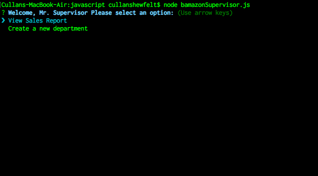
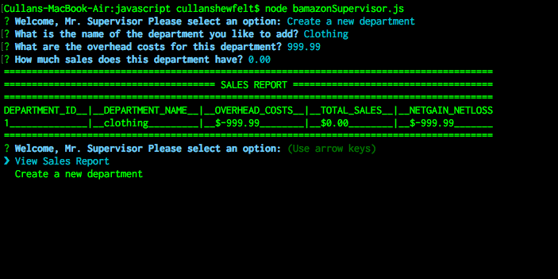
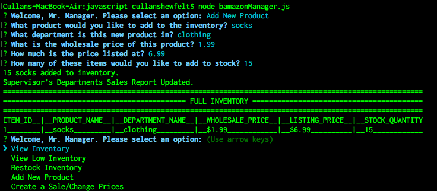
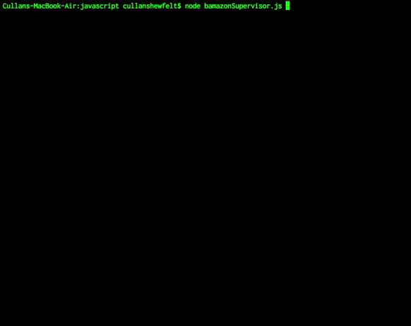
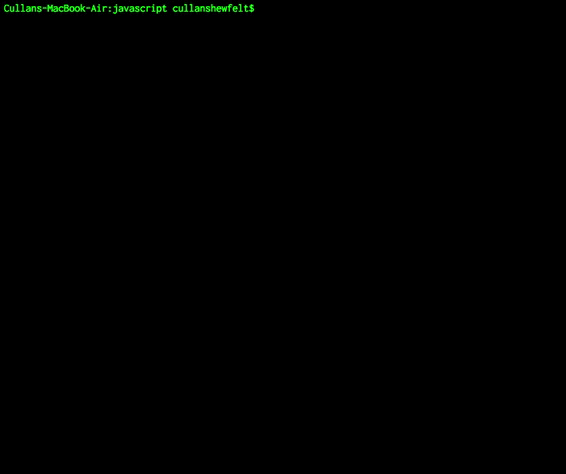
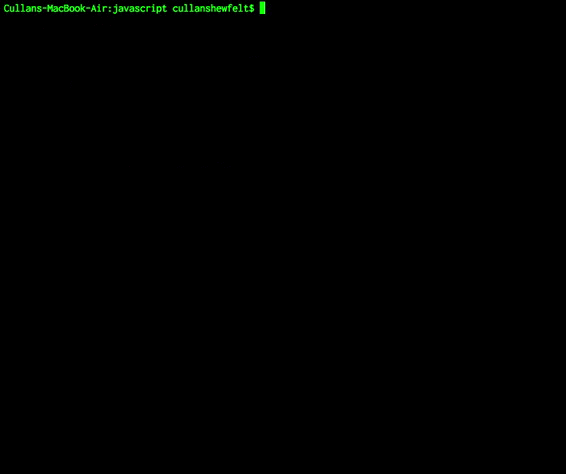

# bAmazon

bAmazon = a server side, node.js based application that is a full eCommerce product management system. Create departments, order &|| restock inventory, customer login with encrypted passwords with hash salts, track purchases & generate sales reports.

## Getting Started

### Prerequisites

node.js

inquirer.js

columnify.js

## Deployment

### Installation

1) To start, open the validation.js file in Sublime. Change the parameters to match those of your MySQL localhost settings (host, port, user, & password). The database name should be untouched: 
```
var connection = mysql.createConnection({
  host: "localhost",
  port: 3306,

  // Your username
  user: yourUsername,

  // Your password
  password: yourPassword,
  database: "Bamazon"
});
```

2) To start, please open the bamazon.sql file, and copy and paste the code into your MySQL application. This script will create a database with three tables, one for Users, one for Products, and one for Departments. 

3)Use your terminal to navigate to the directory which contains the javascript files, and run bamazonSupervisor.js in node.js:
```
node bamazonSupervisor.js
```
You should see this:



 Navigate to Create a new Department, where you will be prompted to input the name of the department, your overhead costs for the department and your total sales for the department, if any. The application will automatically calculate your net gain or net loss. You should automatically see the new department created once you go to view sales report.



4) After creating a new department, launch the bamazonManager.js file in terminal.
```
node bamazonManager.js
```

Here you can add new products to your store. First enter what product you would like to add, what department the product is in (it is important to make sure this department exists by creating it through the bamazonSupervisor.js application as explained above, or else your will not be able to get sales reports), the quantity of the product you would like to add, and finally, indicate how much that product costs.



5) Runthe bamazonSupervisor.js script:

```
node bamazonSupervisor.js
```
Witness the changes to the sales report, and net difference:



6) Run the bamazonCustomer.js script:
```
node bamazonSupervisor.js
```
Create a new user, enter your email address and password when prompted:



The user login is stored in a database. Passwords are encrypted through salting and hashing methods. 
Log in again to make sure it works.

You will be prompted to purchase items here. Type in the item_id number of the product you wish to purchase. You will then be prompted how many of that product you would like to buy. You are then given a notification of what you bought and how much you paid, in total. You should automatically be directed back to the inventory/purchase menu. Notice how the quantity in stock have now changed. 



7) Run the bamazonManager script to check for low inventory, restock your inventory, add new items, and create sales/change prices. 


## Built With

* [Node.js](https://nodejs.org/) - Serverside framework
* [Inquirer.js](https://github.com/SBoudrias/Inquirer.js/) - Node.js middleware library for prompting user input
* [Columnify.js](https://github.com/timoxley/columnify) - Node.js middleware library for formatting data into a "user interface" in the terminal.

## Authors

* **Cullan Shewfelt** - [cullanrocks](https://github.com/cullanrocks)
